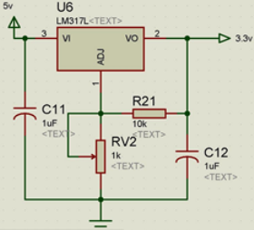

.. -*- coding: utf-8 -*-

.. _rcs_subversion:

Clase 04 - PIII 2019
====================
(Fecha: 30 de agosto)

**Ejercicio:** 

- Crear un programa con lo siguiente:
- Usar el dsPIC33FJ32MC202 
- Interrupción externa INT1
- Flanco descendente
- Pulsador en INT1 con resistencia en Pull up.
- Resolver el problema de no tener un pin para la INT1
- Ver el siguiente `Link <http://download.mikroe.com/documents/compilers/mikroc/dspic/help/peripheral_pin_select_library.htm>`_

**Ejercicio:** 

- Regulador de tensión para los dsPIC33F.
- Alimentación desde un conector USB.
- Utilizar herramientas de medición para asegurarse de los voltajes obtenidos.

**Ejercicio:** 

- Alimentar el dsPIC33FJ32MC202.
- Conectar el Master Clear
- Utilizar capacitores de desacoplo
- Conectar un cristal de cuarzo
- Grabarle un programa creado anteriormente

**Deseñar en Proteus**

- New Design
- Component mode (panel izquierdo)
- P (Pick Device) - permite seleccionar los componentes a utilizar en este proyecto
	- DSPIC33FJ32MC202
	- USBCONN
	- LM317L
	- A700 (es el prefijo de capacitores electrolíticos de alto valor)
	- CAP-ELEC - Capacitores electrolíticos generales
	- POT-HG - Potenciómetro
	- RES - Resistencia
	- LED-RED
	- CRYSTAL
- Terminals Mode - Permite agregar tierra, entrada, salida, etc.
	- GROUND

**Regulador de tensión 3.3v (esto para los dsPIC33F)**

.. figure:: images/clase03/manejo_osciladores.png

.. figure:: images/clase03/osciladores.png
   :target: http://ww1.microchip.com/downloads/en/DeviceDoc/70046E.pdf

.. figure:: images/clase03/calculo_fcy.png

**Ejercicio:** 

- Definir las siguientes funciones:

.. code-block:: c

	void retardarUnSegundo();

	void retardo( int segundos );

- Con la siguiente línea consumimos un ciclo de instrucción sin hacer nada
	
.. code-block:: c
	
	asm nop;

**Resolución Ejercicio (clase pasada):** Esta es una opción para resolverlo sin usar Timers. Pero tener en cuenta que no da exacto. 
Analizar el por qué. Para ver claro que no da exacto, probar con tiempos de 250 us y 133 us.

.. code-block:: c

    int contadorRB0 = 0;
    int contadorRB1 = 0;

    void main()  {
        TRISBbits.TRISB0 = 0;
        TRISBbits.TRISB1 = 0;

        LATBbits.LATB0 = 1;
        LATBbits.LATB1 = 1;

        while(1)  {
            contadorRB0++;
            contadorRB1++;

            if (contadorRB0 >= 250)  {
                LATBbits.LATB0 = ~LATBbits.LATB0;
                contadorRB0 = 0;
            }
        
            if (contadorRB1 >= 133)  {
                LATBbits.LATB1 = ~LATBbits.LATB1;
                contadorRB1 = 0;
            }
        
            Delay_ms(1);
        }
    }
		

