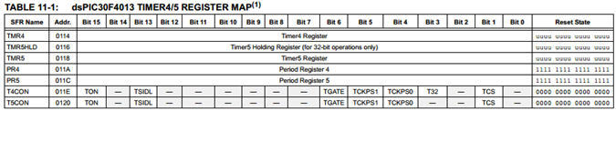

.. -*- coding: utf-8 -*-

.. _rcs_subversion:

Clase 05 - PIII 2019
====================
(Fecha: 4 de septiembre)

.. figure:: images/clase04/manejo_timers.png

**Ejercicio:** Probar cada una de estas afirmaciones (tomamos como ejemplo el Timer2):

- El Timer2 puede acumular pulsos tanto externos (TCS=1) a través del pin T1CK, como internos (TCS=0) al ritmo de la Frecuencia de instrucciones (Tcy).
- Acumulador de pulsos altos en TGate: puede contar los pulsos internos (Tcy) sólo cuando el pin externo T2CK esté a nivel alto, lo que permite contar la duración acumulada de una señal a nivel alto. Para seleccionar este modo hay que poner a 1 los bits TCS y TGATE.
- El interruptor que nos permite encender y apagar el Timer2 es el bit TON. 
- Los impulsos atraviesan el prescaler donde es dividido a razón de 1:1, 1:8, 1:64 y 1:256 en función de la combinación seleccionada en los bits TCKPS<1:0>.
- Se incrementa en una unidad el registro TMR2. En función del bit de configuración TSYNC, si su valor es 1 el incremento de dicho registro será sincronizado con una señal externa. Cada vez que se incrementa el registro TMR2, se compara con el registro PR2 y en caso de igualdad se pone a 0 el TMR2 y se señala el bit de interrupción T2IF. El registro PR2 por defecto vale 0xFFFF con lo que el periodo del Timer2 será ese, pero podemos ajustarlo al valor que queramos, lo que nos permite seleccionar una frecuencia de interrupción programable muy útil.
- Para hacerlos trabajar a 32 bits hay que poner a 1 el bit T32. En este caso, los bits de configuración del Timer de 32 bits serán los del Timer par; es decir, si queremos trabajar con la pareja Timer 2/3 hay que setear los bits del Timer2, incluyendo el bit T32=1.
- El bit de señalización de fin de periodo será el del Timer impar, en nuestro ejemplo se activará el bit T3IF. En el modo de trabajo a 32 bits, la palabra alta la forma el registro TMR impar y la palabra baja el TMR par.

.. figure:: images/clase04/map_timer1.png
   :target: http://ww1.microchip.com/downloads/en/devicedoc/70138c.pdf

.. figure:: images/clase04/map_timer23.png
   :target: http://ww1.microchip.com/downloads/en/devicedoc/70138c.pdf

.. figure:: images/clase04/ejemplo.png

.. code-block::

	void detectarIntT1() org 0x001a  {
	    LATBbits.LATB0 = !LATBbits.LATB0;
	    IFS0bits.T1IF = 0;  // Borramos la bandera de interrupción T1
	}

	void main()  {
	    TRISBbits.TRISB0 = 0;
	    LATBbits.LATB0 = 0;

	    // Modo de operación Timer1
	    T1CON = 0x0000;

	    // Modo operación Timer1: reloj interno, escala 1:1, empieza cuenta en 0
	    TMR1 = 0;

	    // Cuenta 500 ciclos
	    PR1 = 500;

	    // Interrupciones Timer1, borra Bandera de interrupción
	    IFS0bits.T1IF = 0;

	    // Habilita interrupción
	    IEC0bits.T1IE = 1;

	    // Arranca Timer1
	    T1CONbits.TON = 1;

	    while( 1 )
	       asm nop;
	}

**Ejercicio:** 

- Mejorar la solución para el ejercicio de los leds encendiendo a 250 us y 133 us.

