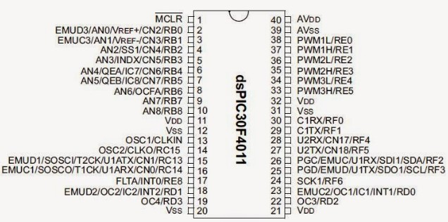

.. -*- coding: utf-8 -*-

.. _rcs_subversion:

Clase 06 - PIII 2019
====================
(Fecha: 6 de septiembre)

**Pinout de los dsPIC que utilizaremos**

.. figure:: images/clase05/dspic33fj32mc202.png
   :target: http://ww1.microchip.com/downloads/en/DeviceDoc/70283K.pdf

.. figure:: images/clase05/dspic30f4013.png
   :target: http://ww1.microchip.com/downloads/en/devicedoc/70138c.pdf
   
.. figure:: images/clase05/dspic30f3010.png
   :target: http://ww1.microchip.com/downloads/en/DeviceDoc/70141F.pdf

Prácticas con la placa de desarrollo con el dsPIC30F4013

