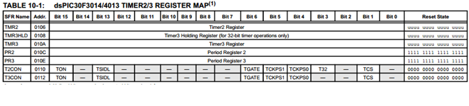

.. -*- coding: utf-8 -*-

.. _rcs_subversion:

Clase 06 - PIII 2020
====================
(Fecha: 11 de septiembre)

**Pinout del dsPIC que utilizaremos**

.. figure:: images/clase05/dspic33fj32mc202.png
   :target: http://ww1.microchip.com/downloads/en/DeviceDoc/70283K.pdf

**Pinout de otros dsPIC que no utilizaremos**   

.. figure:: images/clase05/dspic30f4013.png
   :target: http://ww1.microchip.com/downloads/en/devicedoc/70138c.pdf
   
.. figure:: images/clase05/dspic30f3010.png
   :target: http://ww1.microchip.com/downloads/en/DeviceDoc/70141F.pdf

.. figure:: images/clase05/dspic30f4011.jpg
   :target: http://ww1.microchip.com/downloads/en/devicedoc/70135C.pdf

.. figure:: images/clase04/manejo_timers.png

.. figure:: images/clase04/map_timer1.png
   :target: http://ww1.microchip.com/downloads/en/devicedoc/70138c.pdf

.. figure:: images/clase04/map_timer45.png
   :target: http://ww1.microchip.com/downloads/en/devicedoc/70138c.pdf

.. figure:: images/clase04/ejemplo.png

.. code-block::

	void detectarIntT1() org 0x001a  {
	    LATBbits.LATB0 = !LATBbits.LATB0;
	    IFS0bits.T1IF = 0;  // Borramos la bandera de interrupción T1
	}

	void main()  {
	    TRISBbits.TRISB0 = 0;
	    LATBbits.LATB0 = 0;

	    // Modo de operación Timer1
	    T1CON = 0x0000;

	    // Modo operación Timer1: reloj interno, escala 1:1, empieza cuenta en 0
	    TMR1 = 0;

	    // Cuenta 500 ciclos
	    PR1 = 500;

	    // Interrupciones Timer1, borra Bandera de interrupción
	    IFS0bits.T1IF = 0;

	    // Habilita interrupción
	    IEC0bits.T1IE = 1;

	    // Arranca Timer1
	    T1CONbits.TON = 1;

	    while( 1 )
	       asm nop;
	}

**Ejercicio:** 

- Mejorar la solución para el ejercicio de los leds encendiendo a 250 us y 133 us.

