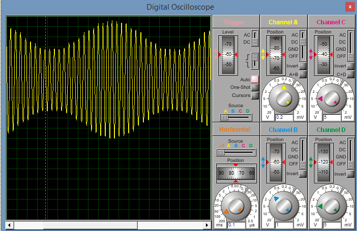

.. -*- coding: utf-8 -*-

.. _rcs_subversion:

Clase 10 - PIII 2019
====================
(Fecha: 25 de septiembre)

Ejercicio:
==========

- Generar una señal de 5Hz pensado para aplicar un efecto trémolo (variación periódica del volumen) a una señal de audio que está siendo muestreada a 1kHz.

Ejercicio:
==========

- Aplicar el trémolo de 5Hz a la señal generada de 100Hz.

Ejercicio:
==========

- Muestrear una señal de audio y aplicar el trémolo anterior.

Ejercicio:
==========

Muestrear una señal analógica (100 Hz, offset de 2 V y 4 Vpp), aplicarle un trémolo y mostrar la resultante luego de un DAC R-2R.

**Especificaciones:**

- Entrada por AN2
- Utilizar Vref+ y Vref- con valores óptimos
- Entíendase el trémolo como una señal modulante con la que se logra un índice de modulación particular
- Frecuencia de muestreo: 1 kHz
- ADC de 12 bits
- Frecuencia del trémolo: 8 Hz
- Hacer parecer a un índice de modulación del 50%

**Ejemplo que sirve de guía:** 

- `Solución de un ejercicio parecido en Proteus <https://github.com/cosimani/Curso-PIII-2016/blob/master/resources/clase06/Ej1.rar?raw=true>`_

.. figure:: images/clase06/Ej1-Esquema.png

.. figure:: images/clase06/Ej1-Osciloscopio.png

