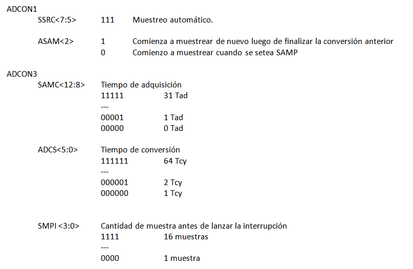
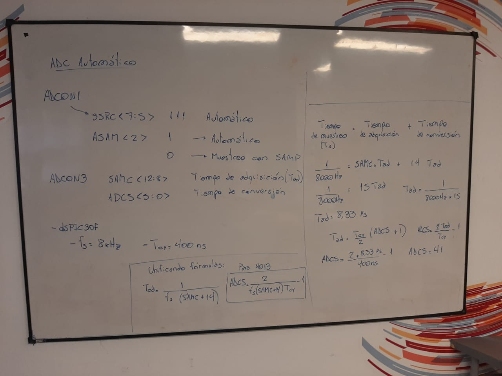
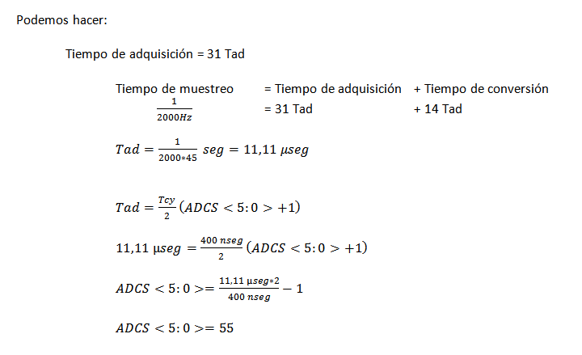

.. -*- coding: utf-8 -*-

.. _rcs_subversion:

Clase 11 - PIII 2019
====================
(Fecha: 27 de septiembre)

**ADC automático para dsPIC30F4013**

.. figure:: images/clase08/adc_auto_2.png

.. figure:: images/clase08/adc_auto_3.png

**Ejemplo:** Realizar cálculo para muestrear la voz humana

.. figure:: images/clase08/adc_auto_ejer_1.png

Ejercicio:
==========
- Programar esto y controlar con el EasydsPIC si la frecuencia de muestreo está bien.

Ejercicio:
==========

- Adaptar el programa para el dsPIC33FJ32MC202 y controlarlo en Proteus.

**Código de ejemplo**

.. code-block:: c

	unsigned int contador = 0;

	void detectar_adc() org 0x002a  {
	    contador = contador + 1;
	    if (contador > 2000)  {  // Para que D1 cambie de estado cada 1 segundo
	        LATDbits.LATD1 = ~LATDbits.LATD1;
	        contador = 0;
	    }

	    IFS0bits.ADIF = 0;
	}

	void config_adc()  {
	    ADPCFG = 0xFFFD;  // Elegimos la entrada analógica

	    ADCON1bits.ADSIDL = 1;  // No trabaja en modo IDLE (modo bajo consumo - CPU off, Peripherals on)
	    ADCON1bits.FORM = 0b00;  // Formato de salida entero
	    ADCON1bits.SSRC = 0b111;  // Muestreo automatico
	    ADCON1bits.ASAM = 1;  // Comienza a muestrear luego de la conversion anterior

	    ADCON2bits.VCFG = 0b000;  // Referencia AVdd y AVss
	    ADCON2bits.SMPI = 0b0000;  // Lanza interrupcion luego de n muestras
	    // 0b0000 - 1 muestra / 0b0001 - 2 muestras / 0b0010 - 3 muestras

	    ADCON3bits.SAMC = 31;
	    ADCON3bits.ADCS = 55;

	    ADCHSbits.CH0SA = 0b0001;  // 0b0000 para AN0 / 0b0001 para AN1 / 0b0010 para AN2

	    ADCON1bits.ADON = 1;
	}

	void configuracionPuertos()  {
	    // Para LEDs de debug
	    TRISDbits.TRISD1 = 0;  // Debug IntADC
	}

	void main()  {
	    configuracionPuertos();

	    config_adc();

	    IEC0bits.ADIE = 1;

	    while(1)  {
	    }
	}

