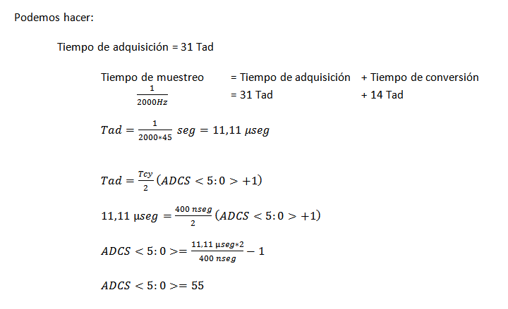

.. -*- coding: utf-8 -*-

.. _rcs_subversion:

Clase 12 - PIII 2019
====================
(Fecha: 2 de octubre)

**Prácticas con placa de desarrollo, R2-R e instrumentos de medición**

Ejercicio:
==========

- Adaptarlo para llevarlo a la placa Easy dsPIC con el dsPIC30F4013

Recomendaciones para crear un proyecto
^^^^^^^^^^^^^^^^^^^^^^^^^^^^^^^^^^^^^^

- Crear carpeta en disco ( C:/UBP/PIII/NombreProyecto )
- Nomenclatura de ejemplo para NombreProyecto
	- P30F_Ej05
	- P33F_Ej12
	- P33F_Generador100Hz
	- P33F_AlgunaDescripcion
- Dentro de esta carpeta crear las carpetas Proteus y MikroC para los 33F o sólo la carpeta MikroC para los 30F.
- Abrir mikroC -- New Porject -- Standard project -- Next
- Project Name: P33F_Ej12 (Notar que estamos colocando el mismo nombre que la carpeta)
- Project folder: C:/UBP/PIII/P33F_Ej12/MikroC
- Device Name: P33FJ32MC202
- Next -- Include None -- Finish
- Al guardar y compilar este proyecto, entre todos los archivos que se generan, los siguientes son los más importantes:
	- P33F_Ej12.mcdps - Archivo de configuración del proyecto. 
	- P33F_Ej12.c - Código fuente en C (Es el código escrito por nosotros)
	- P33F_Ej12.asm - Código fuente en assembler (se autogenera al compilar el proyecto)
	- P33F_Ej12.hex - Usado para programar el dsPIC (se autogenera al compilar el proyecto)
- Escribir el programa. No olvidar lo siguiente:
	- Edit Project ( para ajustar el PLL )
	- Estilo de indentación: Ubicación de llaves, sangría adecuada, espacios, etc..
	- Elección apropiada para nombres de variables y funciones.

- Abrir Proteus ( sólo para los 33F )
- Al guardar el diseño, almacenarlo con el mismo nombre del proyecto ( por ejemplo: P33F_Ej12.DSN )
- En Proteus 7.9, el archivo P33F_Ej12.DSN contiene todo lo referido al proyecto
- En la carpeta C:/UBP/PIII/P33F_Ej12/Proteus

Ejercicio:
==========

- Generar una señal de 4Hz pensado para aplicar un efecto trémolo (variación periódica del volumen) a una señal de audio que está siendo muestreada a 4kHz.
- Si el array tiene demasiados valores, pensar en cómo se podría resolver sabiendo que una senoidal tiene simetría.

Ejercicio 4
===========

- Crear un programa con lo siguiente:
- Usar el dsPIC33FJ32MC202 
- Interrupción externa INT1
- Flanco descendente
- Pulsador en INT1 con resistencia en Pull up.
- Resolver el problema de no tener un pin para la INT1
- Ver el siguiente `Link <http://download.mikroe.com/documents/compilers/mikroc/dspic/help/peripheral_pin_select_library.htm>`_

Ejercicio 5
===========

- Regulador de tensión para los dsPIC33F.
- Alimentación desde un conector USB.
- Utilizar herramientas de medición para asegurarse de los voltajes obtenidos.

Ejercicio 6
===========

- Alimentar el dsPIC33FJ32MC202.
- Conectar el Master Clear
- Utilizar capacitores de desacoplo
- Conectar un cristal de cuarzo
- Grabarle un programa creado anteriormente

**Deseñar en Proteus**

- New Design
- Component mode (panel izquierdo)
- P (Pick Device) - permite seleccionar los componentes a utilizar en este proyecto
	- DSPIC33FJ32MC202
	- USBCONN
	- LM317L
	- A700 (es el prefijo de capacitores electrolíticos de alto valor)
	- CAP-ELEC - Capacitores electrolíticos generales
	- POT-HG - Potenciómetro
	- RES - Resistencia
	- LED-RED
	- CRYSTAL
- Terminals Mode - Permite agregar tierra, entrada, salida, etc.
	- GROUND

**Regulador de tensión 3.3v (esto para los dsPIC33F)**

.. figure:: images/clase01/regulador.png

**Ejercicio:** Probar cada una de estas afirmaciones (tomamos como ejemplo el Timer2):

- El Timer2 puede acumular pulsos tanto externos (TCS=1) a través del pin T1CK, como internos (TCS=0) al ritmo de la Frecuencia de instrucciones (Tcy).
- Acumulador de pulsos altos en TGate: puede contar los pulsos internos (Tcy) sólo cuando el pin externo T2CK esté a nivel alto, lo que permite contar la duración acumulada de una señal a nivel alto. Para seleccionar este modo hay que poner a 1 los bits TCS y TGATE.
- El interruptor que nos permite encender y apagar el Timer2 es el bit TON. 
- Los impulsos atraviesan el prescaler donde es dividido a razón de 1:1, 1:8, 1:64 y 1:256 en función de la combinación seleccionada en los bits TCKPS<1:0>.
- Se incrementa en una unidad el registro TMR2. En función del bit de configuración TSYNC, si su valor es 1 el incremento de dicho registro será sincronizado con una señal externa. Cada vez que se incrementa el registro TMR2, se compara con el registro PR2 y en caso de igualdad se pone a 0 el TMR2 y se señala el bit de interrupción T2IF. El registro PR2 por defecto vale 0xFFFF con lo que el periodo del Timer2 será ese, pero podemos ajustarlo al valor que queramos, lo que nos permite seleccionar una frecuencia de interrupción programable muy útil.
- Para hacerlos trabajar a 32 bits hay que poner a 1 el bit T32. En este caso, los bits de configuración del Timer de 32 bits serán los del Timer par; es decir, si queremos trabajar con la pareja Timer 2/3 hay que setear los bits del Timer2, incluyendo el bit T32=1.
- El bit de señalización de fin de periodo será el del Timer impar, en nuestro ejemplo se activará el bit T3IF. En el modo de trabajo a 32 bits, la palabra alta la forma el registro TMR impar y la palabra baja el TMR par.

Ejercicio:
==========

- Generar una señal de 5Hz pensado para aplicar un efecto trémolo (variación periódica del volumen) a una señal de audio que está siendo muestreada a 1kHz.

Ejercicio:
==========

- Aplicar el trémolo de 5Hz a la señal generada de 100Hz.

.. figure:: images/clase07/captura_tremolo.png

Ejercicio:
==========

- Muestrear una señal de audio y aplicar el trémolo anterior.

Ejercicio:
==========

Muestrear una señal analógica (100 Hz, offset de 2 V y 4 Vpp), aplicarle un trémolo y mostrar la resultante luego de un DAC R-2R.

**Especificaciones:**

- Entrada por AN2
- Utilizar Vref+ y Vref- con valores óptimos
- Entíendase el trémolo como una señal modulante con la que se logra un índice de modulación particular
- Frecuencia de muestreo: 1 kHz
- ADC de 12 bits
- Frecuencia del trémolo: 8 Hz
- Hacer parecer a un índice de modulación del 50%

**Ejemplo que sirve de guía:** 

- `Solución de un ejercicio parecido en Proteus <https://github.com/cosimani/Curso-PIII-2016/blob/master/resources/clase06/Ej1.rar?raw=true>`_

.. figure:: images/clase06/Ej1-Esquema.png

.. figure:: images/clase06/Ej1-Osciloscopio.png

**ADC automático para dsPIC30F4013**

.. figure:: images/clase08/adc_auto_1.png

.. figure:: images/clase08/adc_auto_2.png

.. figure:: images/clase08/adc_auto_3.png

.. figure:: images/clase11/adc_automatico.jpeg

**Ejemplo:** Realizar cálculo para muestrear la voz humana

.. figure:: images/clase08/adc_auto_ejer_1.png

Ejercicio:
==========
- Programar esto y controlar con el EasydsPIC si la frecuencia de muestreo está bien.

Ejercicio:
==========

- Adaptar el programa para el dsPIC33FJ32MC202 y controlarlo en Proteus.

**Código de ejemplo**

.. code-block:: c

	unsigned int contador = 0;

	void detectar_adc() org 0x002a  {
	    contador = contador + 1;
	    if (contador > 2000)  {  // Para que D1 cambie de estado cada 1 segundo
	        LATDbits.LATD1 = ~LATDbits.LATD1;
	        contador = 0;
	    }

	    IFS0bits.ADIF = 0;
	}

	void config_adc()  {
	    ADPCFG = 0xFFFD;  // Elegimos la entrada analógica

	    ADCON1bits.ADSIDL = 1;  // No trabaja en modo IDLE (modo bajo consumo - CPU off, Peripherals on)
	    ADCON1bits.FORM = 0b00;  // Formato de salida entero
	    ADCON1bits.SSRC = 0b111;  // Muestreo automatico
	    ADCON1bits.ASAM = 1;  // Comienza a muestrear luego de la conversion anterior

	    ADCON2bits.VCFG = 0b000;  // Referencia AVdd y AVss
	    ADCON2bits.SMPI = 0b0000;  // Lanza interrupcion luego de n muestras
	    // 0b0000 - 1 muestra / 0b0001 - 2 muestras / 0b0010 - 3 muestras

	    ADCON3bits.SAMC = 31;
	    ADCON3bits.ADCS = 55;

	    ADCHSbits.CH0SA = 0b0001;  // 0b0000 para AN0 / 0b0001 para AN1 / 0b0010 para AN2

	    ADCON1bits.ADON = 1;
	}

	void configuracionPuertos()  {
	    // Para LEDs de debug
	    TRISDbits.TRISD1 = 0;  // Debug IntADC
	}

	void main()  {
	    configuracionPuertos();

	    config_adc();

	    IEC0bits.ADIE = 1;

	    while(1)  {
	    }
	}

