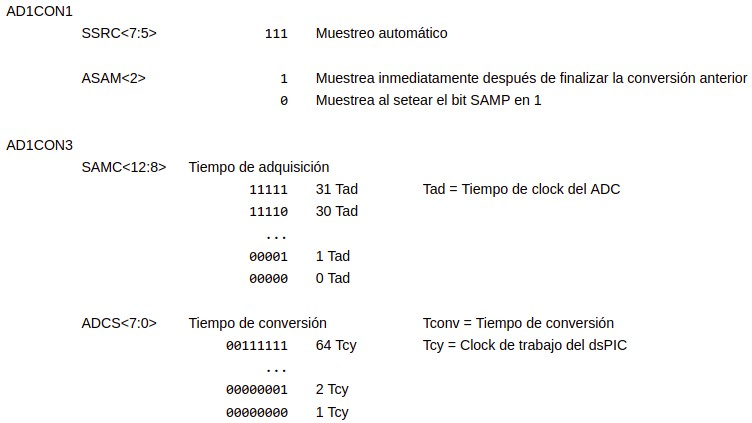

.. -*- coding: utf-8 -*-

.. _rcs_subversion:

Clase 13 - PIII 2020
====================
(Fecha: 9 de octubre)

**Accesos a las hojas de datos**

* `dsPIC33FJ32MC202 - pinout - Interrupciones (pág. 73) - ADC (pág. 203) - TImers <http://ww1.microchip.com/downloads/en/DeviceDoc/70283K.pdf>`_

* `dsPIC33FJ32MC202 - ADC más detallado <http://ww1.microchip.com/downloads/en/DeviceDoc/70183D.pdf>`_

ADC automático para dsPIC33FJ32MC202
====================================

**Tiempo necesario para la conversión**

- Para ADC de 10 bits:   Tconv = 12 Tad
- Para ADC de 12 bits:   Tconv = 14 Tad

**Período de clock del ADC (no es el período de muestreo)**

- Tad = Tcy  (ADCS + 1)

**Tiempo de muestreo**

- Tiempo de muestreo = Tiempo de adquisición + Tiempo de conversión

Ejercicio:
==========
- Adaptar el ejercicio de la clase anterior para usar ADC automático

