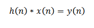

.. -*- coding: utf-8 -*-

.. _rcs_subversion:

Clase 14 - PIII 2019
====================
(Fecha: 9 de octubre)

Programación de filtros
^^^^^^^^^^^^^^^^^^^^^^^	
	
**Función de transferencia**

- Relación entre la entrada y la salida al pasar por el proceso
- Para simplificar, se manipulan en términos de la frecuencia compleja y no del tiempo continuo 
- Las funciones de transferencia en tiempo discreto se hace en término de la variable compleja z
- Se recurre a la transformada Z que representa la frecuencia compleja para tiempo discreto

- Para el tratamiento real en término del tiempo discreto se realiza la transformada inversa de z
- La transformación inversa de la ecuación anterior queda en función del tiempo discreto:

- Esto es una convolución
- El número máximo que asume n es M
- M determina el orden de la función de transferencia

- FIR (Finite Impulse Response): Convolución con muestras pasadas y actuales.
- IIR (Infinite Impulse Response): Filtros recursivos (poseen realimentación). Convolución con muestras pasadas, actuales y también salidas pasadas

**Convolución en C - Filtro FIR**

.. figure:: images/clase08/filtros_3.png

**El código puede ser:**

.. code-block:: c

	#define M 17
	float x[ M ];
	float h[ M ];

	float yn = 0;
	short k;
	
	for ( k = M - 1 ; k >= 1 ; k-- )
	    x[ k ] = x[ k-1 ];
		
	x[ 0 ] = x0;  // x0 es la muestra actual
	
	for ( k = 0 ; k < M ; k++ )
	    yn += h[ k ] * x[ k ];

