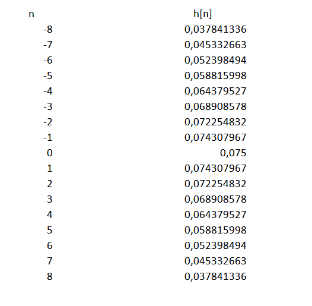

.. -*- coding: utf-8 -*-

.. _rcs_subversion:

Clase 14 - PIII 2020
====================
(Fecha: 14 de octubre)

Programación de filtros
^^^^^^^^^^^^^^^^^^^^^^^	
	
**Función de transferencia**

- Relación entre la entrada y la salida al pasar por el proceso
- Para simplificar, se manipulan en términos de la frecuencia compleja y no del tiempo continuo 
- Las funciones de transferencia en tiempo discreto se hace en término de la variable compleja z
- Se recurre a la transformada Z que representa la frecuencia compleja para tiempo discreto

.. figure:: images/clase08/filtros_1.png

- Para el tratamiento real en término del tiempo discreto se realiza la transformada inversa de z
- La transformación inversa de la ecuación anterior queda en función del tiempo discreto:

.. figure:: images/clase08/filtros_2.png

- Esto es una convolución
- El número máximo que asume n es M
- M determina el orden de la función de transferencia

- FIR (Finite Impulse Response): Convolución con muestras pasadas y actuales.
- IIR (Infinite Impulse Response): Filtros recursivos (poseen realimentación). Convolución con muestras pasadas, actuales y también salidas pasadas

**Convolución en C - Filtro FIR**

.. figure:: images/clase08/filtros_3.png

**El código puede ser:**

.. code-block:: c

	#define M 17
	float x[ M ];
	float h[ M ];

	float yn = 0;
	short k;
	
	for ( k = M - 1 ; k >= 1 ; k-- )
	    x[ k ] = x[ k-1 ];
		
	x[ 0 ] = x0;  // x0 es la muestra actual
	
	for ( k = 0 ; k < M ; k++ )
	    yn += h[ k ] * x[ k ];

**Función de transferencia: Filtro pasa bajos**

.. figure:: images/clase08/filtros_4.png

- Lo podemos calcular con el Excel

.. figure:: images/clase08/filtros_5.png

**Ejemplo Filtro FIR**

- Fs = 4000
- Fc = 150Hz

.. code-block:: c

	#define M 17
	float x[ M ];
	float h[ M ] = 
	    { 0.037841336, 0.045332663, 0.052398494, 0.058815998, 0.064379527,
	      0.068908578, 0.072254832, 0.074307967, 0.075,       0.074307967, 
	      0.072254832, 0.068908578, 0.064379527, 0.058815998, 0.052398494, 
	      0.045332663, 0.037841336 };

	float yn = 0;

	unsigned int i;
	short k;
	float valorActual = 0;

	void  detectarIntADC()  org 0x002E  {
	    IFS0bits.AD1IF = 0;

	    for ( k = M-1 ; k >= 1 ; k-- )  {
	        x[ k ] = x[ k-1 ];
	    }

	    //Se guarda la última muestra.
	    x[ 0 ] = ( ( float )ADC1BUF0 - 2048 );

	    yn = 0;

	    for ( k = 0 ; k < M ; k++ )  {
	        yn += h[ k ] * x[ k ];
	    }

	    valorActual = yn + 2048;

	    LATBbits.LATB2 =  ( (unsigned int) valorActual & 0b0000100000000000 ) >> 11;
	    LATBbits.LATB3 =  ( (unsigned int) valorActual & 0b0000010000000000 ) >> 10;
	    LATBbits.LATB4 =  ( (unsigned int) valorActual & 0b0000001000000000 ) >> 9;
	    LATBbits.LATB5 =  ( (unsigned int) valorActual & 0b0000000100000000 ) >> 8;
	    LATBbits.LATB6 =  ( (unsigned int) valorActual & 0b0000000010000000 ) >> 7;
	    LATBbits.LATB7 =  ( (unsigned int) valorActual & 0b0000000001000000 ) >> 6;
	    LATBbits.LATB8 =  ( (unsigned int) valorActual & 0b0000000000100000 ) >> 5;
	    LATBbits.LATB9 =  ( (unsigned int) valorActual & 0b0000000000010000 ) >> 4;
	    LATBbits.LATB10 = ( (unsigned int) valorActual & 0b0000000000001000 ) >> 3;
	    LATBbits.LATB11 = ( (unsigned int) valorActual & 0b0000000000000100 ) >> 2;
	    LATBbits.LATB12 = ( (unsigned int) valorActual & 0b0000000000000010 ) >> 1;
	    LATBbits.LATB13 = ( (unsigned int) valorActual & 0b0000000000000001 ) >> 0;
	}

	void detectarIntT2() org 0x0022  {

	    IFS0bits.T2IF = 0;  //borra bandera de interrupcion de TIMER2

	    LATBbits.LATB15 = ~LATBbits.LATB15;

	    AD1CON1bits.SAMP = 1;  //pedimos muestras
	    asm nop;               //ciclo instruccion sin operacion
	    AD1CON1bits.SAMP = 0;  //retener muestra e inicia conversion
	}

	void configADC()  {
	    AD1PCFGL = 0b111011;       // elegimos AN2 como entrada para muestras
	    AD1CHS0 = 0b0010;          // usamos AN2 para recibir las muestras en el ADC
	    AD1CON1bits.SSRC = 0b000;  // muestreo manual
	    AD1CON1bits.ADON = 0;      // apagamos ADC
	    AD1CON1bits.AD12B = 1;     // 12bits S&H ADC1
	    AD1CON2bits.VCFG = 0b011;  // tension de referencia externa Vref+ Vref-
	    IEC0bits.AD1IE = 1;        // habilitamos interrupcion del ADC
	}

	void configTIMER2()  {
	    T2CON=0x0000;   //registro de control de TIMER2 a cero
	    T2CONbits.TCKPS=0b00;// prescaler = 1
	    TMR2=0;  //desde donde va a arrancar la cuenta
	    PR2=1250;   //hasta donde cuenta segun calculo para disparo de TIMER2
	    IEC0bits.T2IE=1; //habilitamos interrupciones para TIMER2
	}

	void configPuertos()  {
	    TRISBbits.TRISB2 = 0;
	    TRISBbits.TRISB3 = 0;
	    TRISBbits.TRISB4 = 0;
	    TRISBbits.TRISB5 = 0;
	    TRISBbits.TRISB6 = 0;
	    TRISBbits.TRISB7 = 0;
	    TRISBbits.TRISB8 = 0;
	    TRISBbits.TRISB9 = 0;
	    TRISBbits.TRISB10 = 0;
	    TRISBbits.TRISB11 = 0;
	    TRISBbits.TRISB12 = 0;
	    TRISBbits.TRISB13 = 0;

	    TRISBbits.TRISB15 = 0;  // Debug T2
	}

	void main()  {
	    configPuertos();
	    configTIMER2();
	    configADC();

	    AD1CON1bits.ADON = 1;

	    T2CONbits.TON = 1;

	    while( 1 )  {  }
	}

Algunos ejemplos:
=================

- **Ejemplo 1:** Filtro pasa bajos calculando coeficientes en una función y aplicando filtro con bucle for

- **Ejemplo 2:** Ejemplo anterior modificado para aplicar distintos procesamientos con un pulsador

- **Ejemplo 3:** Filtro pasa bajos calculando coeficientes con Filter Designer Tool y aplicando con librería

Ejemplo 1:
==========

.. code-block:: c

	// dsPIC33FJ32MC202

	// Filtro FIR pasa bajos

	// ADC
	//      10 bits / AN0 / AVdd y AVss / Muestreado con Timer 2

	#define FRECUENCIA_MUESTREO 4000
	#define FRECUENCIA_CORTE 150
	#define M 17

	int index_array = 0;
	int muestra_adc = 0;
	int tremolo = 0;
	float h[ M ];
	float x[ M ];

	float valor_filtrado = 0;

	void calcularCoeficientes()  {
	    int n;

	    for ( n = - ( M - 1 ) / 2 ; n <= ( ( M - 1 ) / 2 ) ; n++ )  {
	        if ( n == 0 )  {
	            h[ n ] = 2 * FRECUENCIA_CORTE / FRECUENCIA_MUESTREO;
	        }
	        else  {
	            h[ n ] = sin( 2 * 3.14159 * FRECUENCIA_CORTE * n / FRECUENCIA_MUESTREO ) / ( 3.14159 * n );
	        }
	    }
	}

	void config_puertos()  {

	    TRISAbits.TRISA0 = 1;  // Entrada AN0

	    TRISBbits.TRISB9 = 0;  // Mas significativo
	    TRISBbits.TRISB8 = 0;
	    TRISBbits.TRISB7 = 0;
	    TRISBbits.TRISB6 = 0;
	    TRISBbits.TRISB5 = 0;
	    TRISBbits.TRISB4 = 0;
	    TRISBbits.TRISB3 = 0;
	    TRISBbits.TRISB2 = 0;
	    TRISBbits.TRISB1 = 0;
	    TRISBbits.TRISB0 = 0;  // Menos significativo

	    TRISBbits.TRISB14 = 0;  // debug_timer
	    TRISBbits.TRISB15 = 0;  // debug_adc
	}

	void config_timer2()  {
	    PR2 = 1 / ( FRECUENCIA_MUESTREO * 0.0000002 );
	}

	void config_adc()  {
	    ADPCFG = 0xFFFE;  // AN0 como entrada analogica

	    // Muestreo la entrada analogica AN0
	    AD1CHS0 = 0b0000;

	    AD1CON1bits.AD12B = 0;  // ADC de 10 bits
	    AD1CON1bits.FORM = 0b00;  // Formato de salida entero
	}

	void interrupcion_timer2() org 0x0022  {
	    IFS0bits.T2IF = 0;

	    LATBbits.LATB14 = ~LATBbits.LATB14;  // debug_timer

	    AD1CON1bits.DONE = 0;  // Antes de pedir una muestra ponemos en cero
	    AD1CON1bits.SAMP = 1;  // Pedimos una muestra

	    asm nop;  // Tiempo que debemos esperar para que tome una muestra

	    AD1CON1bits.SAMP = 0;  // Pedimos que retenga la muestra
	}

	void interrupcion_adc() org 0x002e  {
	    int k;
	    float yn;

	    IFS0bits.AD1IF = 0;

	    LATBbits.LATB15 = ~LATBbits.LATB15;  // debug_adc
	    
	    for ( k = ( M - 1 ) ; k >= 1 ; k-- )  {
	        x[ k ] = x[ k - 1 ];
	    }

	    x[ 0 ] = ( ( float )ADC1BUF0 );
	    
	    yn = 0;

	    for ( k = 0 ; k < M ; k++ )  {
	        yn += h[ k ] * x[ k ];
	    }
	    
	    valor_filtrado = yn;
	    
	    LATBbits.LATB9 = ( (unsigned int)valor_filtrado & 0b0000001000000000 ) >> 9;
	    LATBbits.LATB8 = ( (unsigned int)valor_filtrado & 0b0000000100000000 ) >> 8;
	    LATBbits.LATB7 = ( (unsigned int)valor_filtrado & 0b0000000010000000 ) >> 7;
	    LATBbits.LATB6 = ( (unsigned int)valor_filtrado & 0b0000000001000000 ) >> 6;
	    LATBbits.LATB5 = ( (unsigned int)valor_filtrado & 0b0000000000100000 ) >> 5;
	    LATBbits.LATB4 = ( (unsigned int)valor_filtrado & 0b0000000000010000 ) >> 4;
	    LATBbits.LATB3 = ( (unsigned int)valor_filtrado & 0b0000000000001000 ) >> 3;
	    LATBbits.LATB2 = ( (unsigned int)valor_filtrado & 0b0000000000000100 ) >> 2;
	    LATBbits.LATB1 = ( (unsigned int)valor_filtrado & 0b0000000000000010 ) >> 1;
	    LATBbits.LATB0 = ( (unsigned int)valor_filtrado & 0b0000000000000001 ) >> 0;

	}

	void main()  {

	    calcularCoeficientes();
	    
	    config_puertos();
	    config_timer2();
	    config_adc();

	    IEC0bits.AD1IE = 1;
	    IEC0bits.T2IE = 1;

	    AD1CON1bits.ADON = 1;
	    T2CONbits.TON = 1;

	    while( 1 )  {  }
	}

