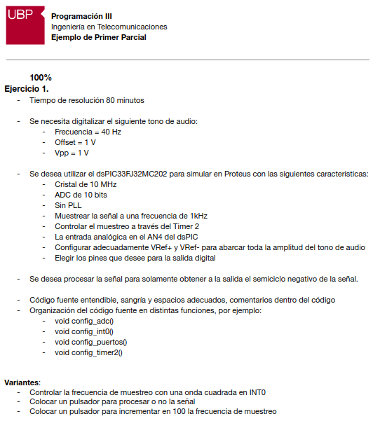

.. -*- coding: utf-8 -*-

.. _rcs_subversion:

Clase 17 - PIII 2019
====================
(Fecha: 18 de octubre)

**Ejercitación para primer parcial**

- Interrupciones (timers, adc y externas)
- ADC automático y manual
- Trémolo
- Generador de funciones
- R-2R

- Con dsPIC33FJ32MC202 en mikroC y Proteus

**Ejemplo de primer parcial**

- `Programa realizado en clase - SemicicloNegativo.zip <https://github.com/cosimani/Curso-PIII-2019/blob/master/resources/clase17/SemicicloNegativo.zip?raw=true>`_

- `Programa que usa pulsador para incrementar la frecuencia de muestreo - Incremento_frec_muestreo.rar <https://github.com/cosimani/Curso-PIII-2019/blob/master/resources/clase17/Incremento_frec_muestreo.rar?raw=true>`_

