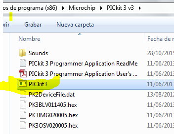
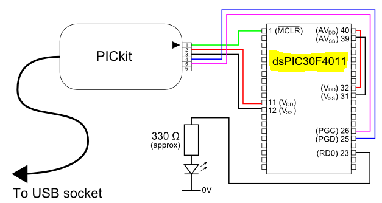

.. -*- coding: utf-8 -*-

.. _rcs_subversion:

Clase 21 - PIII 2019
====================
(Fecha: 8 de noviembre)

**Ejemplo: FFT en entrada en AN8 y envío de datos a través de UART**

- `Descargar desde aquí <https://github.com/cosimani/Curso-PIII-2018/blob/master/resources/clase10/FFTyUART.rar?raw=true>`_

**Ejemplo: FFT en entrada en AN8 y envío de datos a través de UART a una aplicación C++**

- `Descargar desde aquí la aplicación portable <http://www.vayra.com.ar/piii2017/portable.rar>`_

- `Descargar desde aquí el código fuente C++ <http://www.vayra.com.ar/piii2017/fuente.rar>`_

- `Descargar desde aquí el código fuente mikroC <https://github.com/cosimani/Curso-PIII-2019/blob/master/resources/clase21/FFT-AN8-UART.zip?raw=true>`_

- Con este programa probar cómo se generan las bandas laterales en una AM. Tener en cuenta que con los generadores de señales que tenemos, podemos generar una AM.

**Agregar offset a la señal de audio para poder muestrear**

- Si deseamos muestrear la señal de audio desde nuestro celular o computadora, podemos conectar un conector estereo tipo plug de 3.5 mm y utilizar un canal para conectarlo al dsPIC.
- Para muestrarlo entre los valores VRef+ y VRef- debemos agregar un offset. Analizar el siguiente circuito:

.. figure:: images/clase21/agregar_offset.png

- `Clic en este link para simular este circuito <http://www.falstad.com/circuit/circuitjs.html?cct=$+1+0.000005+51.8012824668342+50+5+50%0Ar+288+64+288+160+0+10000%0Ac+288+64+432+64+0+0.00001+-2.4789972859207126%0Ar+432+64+432+160+0+10000%0AR+288+64+240+64+0+1+40+2+0+0+0.5%0AO+432+64+480+64+0%0Ag+288+160+288+176+0%0Ar+352+240+352+304+0+10000%0Ar+352+304+352+368+0+10000%0AR+352+240+352+208+0+0+40+5+0+0+0.5%0Ag+352+368+352+384+0%0Ac+400+304+400+368+0+0.00001+2.5080583286223868%0Aw+352+304+400+304+0%0Aw+352+368+400+368+0%0Aw+400+304+432+304+0%0Aw+432+160+432+304+0%0Ax+442+310+492+313+4+20+Vbias%0Ax+176+70+219+73+4+20+input%0Ao+3+64+0+4098+2.187250724783012+0.00034175792574734563+0+2+3+3%0Ao+4+64+0+4098+8.749002899132048+4.8828125e-105+1+1%0A>`_

- `Revisar este foro para más datos sobre el circuito anterior <https://electronics.stackexchange.com/questions/14404/dc-biasing-audio-signal>`_

Grabación de dsPIC con Pickit 3
^^^^^^^^^^^^^^^^^^^^^^^^^^^^^^^

- El Pickit 3 permite programar el dsPIC grabando el archivo .hex compilado con el mikroC
- Requiere el aplicativo programador. `Descargar desde aquí <https://github.com/cosimani/Curso-PIII-2018/blob/master/resources/clase11/PICkit3Setup.rar?raw=true>`_

.. figure:: images/clase11/pickit3_1.png

- Conectar el Pickit 3 a la PC y esperar que instale controladores (la instalación del aplicativo instala los controladores también).

- Para abrirlo ejecutamos:

- Podemos probar conectando la Demo board que viene con el PicKit 3 ( más info en: http://ww1.microchip.com/downloads/en/devicedoc/40001296c.pdf )

- Le damos a Check Comunication y nos detecta la Demo Board conectada:

.. figure:: images/clase10/im6.png

- Si conectamos el circuito de grabación del dsPIC30F3010, también lo detecta:

.. figure:: images/clase10/im7.png

- Se puede leer el dsPIC y grabar el firmware en un .hex y también se puede escribir nuestro .hex creado con mikroC.

- Se conecta de la siguiente manera:

**Ejercicio**

- Hacer un Hola Mundo en mikroC simplemente para hacer parpadear un led. Escribir el programa en mikroC, compilar para generar el hex, grabarlo con el PicKit 3 y por último probarlo en la placa.

