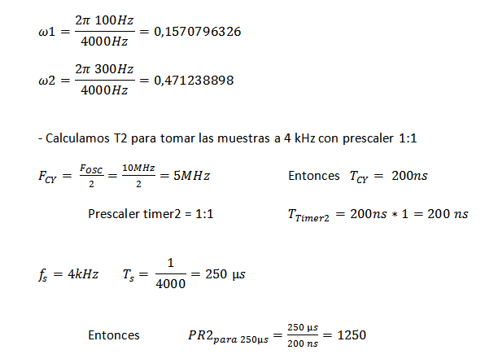

.. -*- coding: utf-8 -*-

.. _rcs_subversion:

Clase 25 - PIII 2019
====================
(Fecha: 22 de noviembre)

**Transformada de Fourier**

- Es un análisis en frecuencia de las señales
- La Transformada de Fourier nos indica de qué manera se distribuye, en función de la frecuencia, la potencia de la señal
- La Transformada de Fourier nos transforma una función (en el dominio del tiempo t) en otra función (en el dominio de la frecuencia f).
- La función en el dominio de la frecuencia tiene valores complejos.
- Se calcula el módulo para conocer las magnitudes (números reales) de cada componente en frecuencia (es lo que muestra un analizador de espectro).
- Cuando la función (en el dominio del tiempo t) es discreta, se utiliza la Transformada Discreta de Fourier (DFT: Discrete Fourier Transform).
- La Transformada Rápida de Fourier (FFT: Fast Fourier Transform) es simplemente un algoritmo eficiente para calcular la DFT. 

**Transformada Discreta de Fourier (DFT)**

.. figure:: images/clase11/im1.png

- Esta última ecuación escrita en C quedaría:

.. code-block:: c

	float dft( float * x_n, float w, unsigned int NN )  {
	    unsigned short n;
	    float R = 0.0, I = 0.0;

	    // Bucle for para realizar las sumatorias.
	    for( n = 0 ; n < NN ; n++ )  {
	        // Cálculo y sumatoria de los componentes
	        // reales e imaginarios.
	        R += x_n[ n ] * cos( w * n );
	        I += x_n[ n ] * sin( w * n );
	    }

	    return sqrt( R * R + I * I ); 
	}

.. figure:: images/clase11/im2.png	

**Ejemplo:** Deseamos averiguar la presencia de frecuencias de 100 Hz y 300 Hz en una señal de audio muestreada a 4kHz.

.. code-block:: c

	void  detectarIntADC()  org 0x002E  {
	    IFS0bits.AD1IF = 0;

	    // Se corren las últimas 64 muestras en el bufer x.
	    for( i = 63; i != 0; i-- )
	        x[ i ] = x[ i - 1 ];

	    // Se guarda la última muestra.
	    x[ 0 ] = ( ( float )ADC1BUF0 );

	    cont = cont + 1;  // Se cuentan las muestras tomadas.

	    if ( cont == 64 )  {  // Se espera a recibir 64 muestras.

	        resultado1 = dft( x, 0.1570796326, 64 );
	        resultado2 = dft( x, 0.47123889803846, 64 );

	        if( resultado1 > 500 )
	            LATBbits.LATB0 = 1;
	        else
	            LATBbits.LATB0 = 0;

	        if( resultado2 > 500 )
	            LATBbits.LATB1 = 1;
	        else
	            LATBbits.LATB1 = 0;

	        cont = 0;
	    }
	}

**Ejemplo:** El cálculo del ejemplo anterior se encuentra optimizado dentro de la biblioteca de funciones de MikroC utilizando el algoritmo FFT y se utiliza de la siguiente manera:

- Video demostración: https://www.youtube.com/watch?v=n_HLYY41g1E

.. code-block:: c

	// dsPIC30F4013
	// Placa Easy dsPIC 
	// Entrada analogica AN7 - VRef es AVdd y AVss -
	// Detecta las frecuencias 100 Hz, 200 Hz, 300 Hz, ..., 6300 Hz
	// Publica el resultado en binario en los puertos RB0-RB5 (valores desde 1 al 63)

	const unsigned long CANT_MUESTRAS = 128;  // 128 pares de valores [Re, Im]
	const unsigned long FREC_MUESTREO  = 12800;  // Frecuencia de muestreo.

	unsigned Samples[ CANT_MUESTRAS * 2 ];  // Capacidad para 256. Porque son 128 pares

	// La funcion FFT requiere que las muestras se almacenen en el bloque de datos Y.
	// Este bloque de memoria es una caracteristica de los dsPIC que permite realizar
	// operaciones en una sola instruccion, lo que aumenta la velocidad de calculo.
	ydata unsigned InputSamples[ CANT_MUESTRAS * 2 ];

	unsigned freq = 0;

	// Es un indice para llevar la cuenta de cuantas muestras vamos guardando en Samples.
	unsigned globali = 0;

	// Bandera para saber si ya se encuentra listo el procesamiento FFT para mostrar el resultado.
	char listo = 0;

	void configuracionADC()  {
	    ADPCFG = 0b01111111;  // elegimos AN7 como entrada para muestras
	    ADCHS = 0b0111; // usamos AN7 para recibir las muestras en el ADC
	    ADCON1bits.SSRC = 0b111; //  Internal counter ends sampling and starts conversion (auto convert)
	    ADCON1bits.FORM = 0b11;  // Signed Fractional (DOUT = sddd dddd dd00 0000)
	    ADCON2bits.VCFG = 0b000;  // tension de referencia Avdd y Avss
	}

	// Function for converting 1.15 radix point to IEEE floating point variable (needed for sqrt).
	float Fract2Float( int input )  {
	    if ( input < 0 )
	        input = - input;
	    return ( input / 32768. );
	}

	// Analiza los componentes de la FFT para luego publicar el resultado en los puertos RB0-RB5
	// Las muestras "Samples" contiene la secuencia Re, Im, Re, Im...
	void obtenerResultado() {
	    unsigned Re, Im, k, max;
	    unsigned i = 0;  // Solo como indice para ir avanzando sobre InputSamples
	    float    ReFloat, ImFloat, amplitud;

	    // La k corresponde al componente, k=0 para la continua, k=1 para 100 Hz,
	    // k=2 para 200 Hz, etc. hasta k=63 para 6300 Hz
	    k = 0;
	    max = 0;  // Almacena el valor maximo de la amplitud de la muestra DFT
	    freq = 0;  // Reset current max. frequency for new reading

	    // 63 ciclos porque no podria muestrear mas de 63 * 100 Hz = 6300 Hz
	    // (que es la mitad de la frecuencia de muestreo)
	    while ( k < ( CANT_MUESTRAS / 2 ) )  {
	        Re = InputSamples[ i++ ];  // Parte Real de la muestra DFT
	        Im = InputSamples[ i++ ];  // Parte Imaginaria de la muestra DFT

	        ReFloat = Fract2Float( Re );  // Conversion a float
	        ImFloat = Fract2Float( Im );  // Conversion a float

	        // Amplitud de la actual muestra DFT
	        amplitud = sqrt( ReFloat * ReFloat + ImFloat * ImFloat );

	        // DFT esta en escala 1/amplitud, por eso lo volvemos a escala
	        amplitud  = amplitud * CANT_MUESTRAS;

	        if ( k == 0 )
	            amplitud = 0;  // Elimina la continua

	        if ( amplitud > max ) {
	            max = amplitud;  // Almacenamos el valor maximo hasta ahora
	            freq = k;  // Almacenamos el componente con mayor potencia
	        }

	        // Avanzamos de a un componente.
	        // En este caso, nos desplzamos 100 Hz cada vez que incrementamos k
	        k++;
	    }

	    // Con esta linea freq tomaria los valores en Hz de la frecuencia con mas potencia.
	    // freq *= (FREC_MUESTREO / CANT_MUESTRAS);

	    // Desplegamos el valor en los puertos RB0-RB5
	    LATBbits.LATB5 = ( freq & 0b0000000000100000 ) >> 5;
	    LATBbits.LATB4 = ( freq & 0b0000000000010000 ) >> 4;
	    LATBbits.LATB3 = ( freq & 0b0000000000001000 ) >> 3;
	    LATBbits.LATB2 = ( freq & 0b0000000000000100 ) >> 2;
	    LATBbits.LATB1 = ( freq & 0b0000000000000010 ) >> 1;
	    LATBbits.LATB0 = ( freq & 0b0000000000000001 ) >> 0;

	    LATBbits.LATB11 = !LATBbits.LATB11;  // Cada vez que se publica el resultado
	}

	unsigned leerAdc()  {
	    ADCON1bits.SAMP = 1;  // Pedimos una muestra
	    asm nop;  // Tiempo que debemos esperar para que tome una muestra
	    ADCON1bits.SAMP = 0;  // Pedimos que retenga la muestra

	    return ADCBUF0;  // Devolvemos el valor muestreado por el ADC
	}

	// Llena Samples con las muestras en Re y Im se pone en 0. Luego copia en el bloque de memoria Y
	void SampleInput()  {
	    Samples[ globali++ ] = leerAdc();   // Re
	    Samples[ globali++ ] = 0;           // Im

	    LATFbits.LATF1 = !LATFbits.LATF1;  // En este puerto se puede ver la frecuencia de muestreo

	    // Entra a este if cuando ya tiene 128 pares.
	    if ( globali >= ( CANT_MUESTRAS * 2 ) )  {
	        globali = 0;
	        if ( ! listo )  {  // Todavia no tenemos suficientes muestras

	            // Copiamos las muestras del ADC hacia el bloque de memoria Y
	            memcpy( InputSamples, Samples, CANT_MUESTRAS * 2 );

	            // Ya estamos listos para aplicar FFT.
	            // Esto habilita el uso de la funcion FFT en la funcion main()
	            listo = 1;
	        }
	    }
	}

	void  configuracionPuertos()  {
	    TRISFbits.TRISF1 = 0;  // Debug frec de muestreo
	    TRISBbits.TRISB11 = 0;  // Debug cada vez que se publica el resultado

	    // Lo siguientes puertos para mostrar la frecuencia con mayor potencia
	    TRISBbits.TRISB0 = 0;
	    TRISBbits.TRISB1 = 0;
	    TRISBbits.TRISB2 = 0;
	    TRISBbits.TRISB3 = 0;
	    TRISBbits.TRISB4 = 0;
	    TRISBbits.TRISB5 = 0;

	    TRISBbits.TRISB7 = 1;  // AN7 para entrada analogica

	}

	void detectarT2() org 0x0020  {
	    SampleInput();  // Se encarga de tomar las muestras
	    IFS0bits.T2IF = 0;  // Bandera Timer 2
	}

	void configuracionT2()  {
	    PR2 = ( unsigned long )( Get_Fosc_kHz() ) * 1000 / ( 4 * FREC_MUESTREO );
	    IEC0bits.T2IE = 1;  // Habilitamos interrucion del Timer 2
	}

	void main()  {

	    memset( InputSamples, 0, CANT_MUESTRAS * 2 );  // Ponemos en cero el buffer para las muestras

	    configuracionPuertos();

	    configuracionT2();
	    T2CONbits.TON = 1;  // Encendemos Timer 2

	    configuracionADC();
	    ADCON1bits.ADON = 1;  // Encendemos el ADC

	    while ( 1 )  {
	        if ( listo ) {
	            // Calcula FFT en 7 etapas, 128 pares de muestras almacenados en InputSamples.
	            FFT( 7, TwiddleCoeff_128, InputSamples );

	            // Método de inversión de bits, necesario para aplicar el algoritmo de FFT.
	            BitReverseComplex( 7, InputSamples );

	            // Analiza la amplitud de las muestras DFT y publica resultados en RB0-RB5
	            obtenerResultado();  

	            listo = 0;  // Indicamos que publicamos un resultado y esperamos el proximo analisis
	        }
	    }
	}

Ejercicio:
==========

- Modificar el ejemplo para utilizar la interrupción del ADC.

Ejercicio:
==========

- Modificar el ejemplo para utilizar ADC automático y no usar el timer.

Ejercicio:
==========

- En lugar de realizar el análisis cada 100Hz, realizarlo cada 10Hz.

Ejercicio:
==========

- Elegir la frecuencia de una cuerda de la guitarra y adaptar el programa para hacer un afinador de esa cuerda.

Ejercicio:
==========

- Elegir una frecuencia particular y visualizar en los puertos RB la potencia de esa frecuencia (como un vúmetro digital).

Ejemplo analizado en clase:
===========================

- El siguiente código corresponde al mismo ejemplo anterior con algunas pequeñas modificaciones que decidimos en clase.

- `Programa realizado en clase - clase20_PrimerFFT.zip <https://github.com/cosimani/Curso-PIII-2019/blob/master/resources/clase20/clase20_PrimerFFT.zip?raw=true>`_

**Problema con el Ejemplo del filtro paso bajos aplicado "a mano"**

- Utilizando el código que hace la sumatoria del producto de los valores de los vectores, se consume demasiado tiempo.
- Tanto tiempo que no se puede mantener la frecuencia de muestreo.
- Una opción es usar PLL.
- El siguiente código resuelve el caso con PLL x8, para el dsPIC30F4013 con cristal de 10MHz

.. code-block:: c

	#define M 17
	float x[ M ];
	float h[ M ] =  {
	    0.037841336, 0.045332663, 0.052398494, 0.058815998, 0.064379527, 
	    0.068908578, 0.072254832, 0.074307967, 0.075000000, 0.074307967, 
	    0.072254832, 0.068908578, 0.064379527, 0.058815998, 0.052398494, 
	    0.045332663, 0.037841336
	};

	float yn = 0;

	unsigned int i;
	short k;
	float valorActual = 0;

	void  detectarIntADC()  org 0x002A  {

	    IFS0bits.ADIF=0;

	    for ( k = M-1 ; k >= 1 ; k-- )  {
	        x[ k ] = x[ k - 1 ];
	    }

	    //Se guarda la última muestra.
	    x[ 0 ] = ( ( float )ADCBUF0 - 2048 );

	    yn = 0;

	    for ( k = 0 ; k < M ; k++ )  {
	        yn += h[ k ] * x[ k ];
	    }

	    valorActual = yn + 2048;

	    LATCbits.LATC14 = ( (unsigned int) valorActual & 0b0000100000000000) >> 11;
	    LATBbits.LATB2 =  ( (unsigned int) valorActual & 0b0000010000000000) >> 10;
	    LATBbits.LATB3 =  ( (unsigned int) valorActual & 0b0000001000000000) >> 9;
	    LATBbits.LATB4 =  ( (unsigned int) valorActual & 0b0000000100000000) >> 8;
	    LATBbits.LATB5 =  ( (unsigned int) valorActual & 0b0000000010000000) >> 7;
	    LATBbits.LATB6 =  ( (unsigned int) valorActual & 0b0000000001000000) >> 6;
	    LATBbits.LATB8 =  ( (unsigned int) valorActual & 0b0000000000100000) >> 5;
	    LATBbits.LATB9 =  ( (unsigned int) valorActual & 0b0000000000010000) >> 4;
	    LATBbits.LATB10 = ( (unsigned int) valorActual & 0b0000000000001000) >> 3;
	    LATBbits.LATB11 = ( (unsigned int) valorActual & 0b0000000000000100) >> 2;
	    LATBbits.LATB12 = ( (unsigned int) valorActual & 0b0000000000000010) >> 1;
	    LATCbits.LATC13 = ( (unsigned int) valorActual & 0b0000000000000001) >> 0;

	    LATDbits.LATD1 = ~LATDbits.LATD1;

	}

	void detectarIntT2() org 0x0020  {

	    IFS0bits.T2IF = 0;  // borra bandera de interrupcion de T2

	    ADCON1bits.SAMP = 1; // pedimos muestras
	    asm nop;  //ciclo de instruccion sin operacion
	    ADCON1bits.SAMP = 0;  // retener muestra e iniciar conversion
	}

	void configADC()  {
	    ADPCFG = 0b111110;  // elegimos AN0 como entrada para muestras
	    ADCHS = 0b0000;  // usamos AN0 para recibir las muestras en el ADC
	    ADCON1bits.SSRC = 0b000; // muestreo manual
	    ADCON2bits.VCFG = 0b000;  //tension de referencia externa Vref+ Vref-

	    IEC0bits.ADIE = 1;  //habilitamos interrupcion del ADC
	}

	void configT2()  {
	    T2CONbits.TCKPS = 0b00;  // prescaler = 1
	    PR2 = 5000;   // PLLx8 - cristal 10MHz - Tcy=50ns - Entonces fs=4kHz

	    IEC0bits.T2IE = 1; // habilitamos interrupciones para T2
	}

	void configPuertos()  {
	    TRISCbits.TRISC14 = 0;  // Bit mas significativo de la senal generada
	    TRISBbits.TRISB2  = 0;
	    TRISBbits.TRISB3  = 0;
	    TRISBbits.TRISB4  = 0;
	    TRISBbits.TRISB5  = 0;
	    TRISBbits.TRISB6  = 0;
	    TRISBbits.TRISB8  = 0;
	    TRISBbits.TRISB9  = 0;
	    TRISBbits.TRISB10 = 0;
	    TRISBbits.TRISB11 = 0;
	    TRISBbits.TRISB12 = 0;
	    TRISCbits.TRISC13 = 0;  // Bit menos significativo de la senal generada

	    TRISDbits.TRISD1=0;  // Debug
	}

	void main()  {
	    configPuertos();
	    configT2();
	    configADC();

	    ADCON1bits.ADON = 1;

	    T2CONbits.TON = 1;

	    while(1)  {  }
	}

Probando filtros en placa
=========================

- Video sobre cómo utilizar el generador de señal (https://www.youtube.com/watch?v=qCRcNYbqBxs)

**Ejemplo para dsPIC30F4013 para Placa**

.. code-block:: c

	// Device setup:
	//     Device name: P30F4013
	//     Device clock: 010.000000 MHz
	//     Dev. board: EasydsPic4A
	//     Sampling Frequency: 4000 Hz
	// Filter setup:
	//     Filter kind: FIR
	//     Filter type: Lowpass filter
	//     Filter order: 30
	//     Filter window: Hamming
	//     Filter borders:
	//       Wpass:150 Hz
	const unsigned BUFFFER_SIZE  = 32;
	const unsigned FILTER_ORDER  = 30;

	const unsigned COEFF_B[ FILTER_ORDER + 1 ] = {
	    0xFFD5, 0xFFEB, 0x000F, 0x005A, 0x00E6, 0x01C9,
	    0x0312, 0x04C4, 0x06D3, 0x0926, 0x0B98, 0x0DF9,
	    0x1017, 0x11C3, 0x12D5, 0x1333, 0x12D5, 0x11C3,
	    0x1017, 0x0DF9, 0x0B98, 0x0926, 0x06D3, 0x04C4,
	    0x0312, 0x01C9, 0x00E6, 0x005A, 0x000F, 0xFFEB,
	    0xFFD5
	};

	unsigned inext;                       // Input buffer index
	ydata unsigned input[ BUFFFER_SIZE ];   // Input buffer, must be in Y data space

	void  detectarIntADC()  org 0x002a  {
	    unsigned CurrentValue;

	    IFS0bits.ADIF = 0; // Borramos el flag de interrupciones del ADC
	    LATFbits.LATF1 = !LATFbits.LATF1;  // Para debug de la interrupcion ADC

	    if( PORTFbits.RF4 == 0 )  {
	        LATFbits.LATF5 = 1;  // Filtro no aplicado

	        input[ inext ] = ADCBUF0;  // Fetch sample

	        CurrentValue = FIR_Radix( FILTER_ORDER + 1,  // Filter order
	                                  COEFF_B,           // b coefficients of the filter
	                                  BUFFFER_SIZE,      // Input buffer length
	                                  input,             // Input buffer
	                                  inext );           // Current sample

	        inext = ( inext + 1 ) & ( BUFFFER_SIZE - 1 );  // inext = ( inext + 1 ) mod BUFFFER_SIZE;

	        LATCbits.LATC14 = ( ( unsigned int )CurrentValue & 0b0000100000000000) >> 11;
	        LATBbits.LATB2 =  ( ( unsigned int )CurrentValue & 0b0000010000000000) >> 10;
	        LATBbits.LATB3 =  ( ( unsigned int )CurrentValue & 0b0000001000000000) >> 9;
	        LATBbits.LATB4 =  ( ( unsigned int )CurrentValue & 0b0000000100000000) >> 8;
	        LATBbits.LATB5 =  ( ( unsigned int )CurrentValue & 0b0000000010000000) >> 7;
	        LATBbits.LATB6 =  ( ( unsigned int )CurrentValue & 0b0000000001000000) >> 6;
	        LATBbits.LATB8 =  ( ( unsigned int )CurrentValue & 0b0000000000100000) >> 5;
	        LATBbits.LATB9 =  ( ( unsigned int )CurrentValue & 0b0000000000010000) >> 4;
	        LATBbits.LATB10 = ( ( unsigned int )CurrentValue & 0b0000000000001000) >> 3;
	        LATBbits.LATB11 = ( ( unsigned int )CurrentValue & 0b0000000000000100) >> 2;
	        LATBbits.LATB12 = ( ( unsigned int )CurrentValue & 0b0000000000000010) >> 1;
	        LATCbits.LATC13 = ( ( unsigned int )CurrentValue & 0b0000000000000001) >> 0;

	    }
	    else  {
	        LATFbits.LATF5 = 0;  // Filtro no aplicado

	        LATCbits.LATC14 = ADCBUF0.B11;
	        LATBbits.LATB2 = ADCBUF0.B10;
	        LATBbits.LATB3 = ADCBUF0.B9;
	        LATBbits.LATB4 = ADCBUF0.B8;
	        LATBbits.LATB5 = ADCBUF0.B7;
	        LATBbits.LATB6 = ADCBUF0.B6;
	        LATBbits.LATB8 = ADCBUF0.B5;
	        LATBbits.LATB9 = ADCBUF0.B4;
	        LATBbits.LATB10 = ADCBUF0.B3;
	        LATBbits.LATB11 = ADCBUF0.B2;
	        LATBbits.LATB12 = ADCBUF0.B1;
	        LATCbits.LATC13 = ADCBUF0.B0;
	    }

	    LATDbits.LATD1 = ~LATDbits.LATD1;
	}

	void detectarIntT2() org 0x0020  {
	    IFS0bits.T2IF = 0;  //borra bandera de interrupcion de T2

	    LATFbits.LATF0 = !LATFbits.LATF0;

	    ADCON1bits.SAMP = 1; // pedimos muestras
	    asm nop;  // ciclo instruccion sin operacion
	    ADCON1bits.SAMP = 0;  // etener muestra e inicia conversion
	}

	void configADC()  {
	    ADPCFG = 0b111110;  // elegimos AN0 como entrada para muestras
	    ADCHS = 0b0000; // usamos AN0 para recibir las muestras en el ADC
	    ADCON1bits.SSRC = 0b000; // muestreo manual
	    ADCON1bits.ADON = 0;  // apagamos ADC
	    ADCON2bits.VCFG = 0b000;  // tension de referencia 0 y 5
	    IEC0bits.ADIE = 1;  // habilitamos interrupcion del ADC
	}

	void configT2()  {
	    PR2 = 5000;  
	    IEC0bits.T2IE = 1; // habilitamos interrupciones para T2
	}

	void configPuertos()  {

	    TRISCbits.TRISC14 = 0;  // Bit mas significativo de la senal generada
	    TRISBbits.TRISB2  = 0;
	    TRISBbits.TRISB3  = 0;
	    TRISBbits.TRISB4  = 0;
	    TRISBbits.TRISB5  = 0;
	    TRISBbits.TRISB6  = 0;
	    TRISBbits.TRISB8  = 0;
	    TRISBbits.TRISB9  = 0;
	    TRISBbits.TRISB10 = 0;
	    TRISBbits.TRISB11 = 0;
	    TRISBbits.TRISB12 = 0;
	    TRISCbits.TRISC13 = 0;  // Bit menos significativo de la senal generada

	    TRISDbits.TRISD1 = 0;  // Debug

	    TRISBbits.TRISB0 = 1;  // AN0

	    TRISFbits.TRISF0 = 0;  // Debug 
	    TRISFbits.TRISF1 = 0;  // Debug 

	    TRISFbits.TRISF4 = 1;  // Filtro y no filtro

	    TRISFbits.TRISF5 = 0;  // Led indicador de filtro aplicado
	}

	void main()  {
	    configPuertos();
	    configT2();
	    configADC();

	    ADCON1bits.ADON = 1;

	    T2CONbits.TON = 1;

	    while(1)  {  }
	}

Ejercicio:
==========

- Usar la placa con el dsPIC30F4013 y defina los parámetros que considere para lograr lo siguiente:
	- Filtro pasa bajos con frecuencia de corte 200 Hz
	- ADC Automático 
	- DAC R-2R
	- Usar el generador de señales del laboratorio
	- Elegir un pulsador para intercambiar entre:
		- Default: Señal sin procesar
		- 1- Pasa bajos con frecuencia de corte 200 Hz
		- 2- Pasa bajos con frecuencia de corte según se indica para cada alumno

- Entregar:
	- Video de aproximadamente 10 segundos mostrando cómo se atenúa la señal de entrada
	- Código fuente con comentarios en el código y organizado en funciones

**Variaciones por alumno:**

:Juan:
    Frecuencia de corte para el segundo pasa bajos: 800 Hz
	
    Frecuencia de muestreo: 5 kHz

:Pablo:
    Frecuencia de corte para el segundo pasa bajos: 500 Hz
	
    Frecuencia de muestreo: 7 kHz

:Conrado:
    Frecuencia de corte para el segundo pasa bajos: 700 Hz
	
    Frecuencia de muestreo: 4 kHz

:Facundo:
    Frecuencia de corte para el segundo pasa bajos: 600 Hz
	
    Frecuencia de muestreo: 6 kHz

Ejemplo:
========

- Colocar un pulsador en INT0 para conmutar entre señal sin procesar, filtro pasa bajos y filtro pasa altos.
- Utilizar la placa de desarrollo y el dsPIC30F4013

- `Programa realizado en clase - Clase19_dos_filtros.zip <https://github.com/cosimani/Curso-PIII-2019/blob/master/resources/clase19/Clase19_dos_filtros.zip?raw=true>`_

**Ejemplo para revisar**

- `Ejemplo de trémolo en Proteus y mikroC <https://github.com/cosimani/Curso-PIII-2019/blob/master/resources/clase15/EjemploClase15.rar?raw=true>`_

Ejercicio:
=========

- Programar esto y controlar en Proteus. 
- Analizar si la frecuencia de muestreo es la misma con el ADC encendido y apagado. Es decir, realizando el procesamiento de la señal o no.
- De ser necesario, definir una frecuencia de muestreo tal que no se vea afectado el procesamiento.
- Identificar cuál es la frecuencia máxima a la que se podría muestrear.

Ejercicio:
=========

- Calcular esa frecuencia máxima para el ADC automático.

Ejercicio:
=========

- Intentar utilizar el código que genera el Filter Designer Tool del mikroC. 

**Ejemplo para dsPIC33FJ32MC202 para Proteus**

- `Proyecto en Proteus 8.1 <https://github.com/cosimani/Curso-PIII-2016/blob/master/resources/clase08/EjemploClase8.rar?raw=true>`_

.. code-block:: c

	// Device setup:
	//     Device name: P33FJ32MC202
	//     Device clock: 010.000000 MHz
	//     Sampling Frequency: 1000 Hz
	// Filter setup:
	//     Filter kind: FIR
	//     Filter type: Lowpass filter
	//     Filter order: 30
	//     Filter window: Hamming
	//     Filter borders:
	//       Wpass:30 Hz
	const unsigned BUFFFER_SIZE  = 32;
	const unsigned FILTER_ORDER  = 30;

	const unsigned COEFF_B[FILTER_ORDER+1] = {
	    0x0022, 0x0041, 0x007B, 0x00E1, 0x0182, 0x0267,
	    0x0393, 0x0500, 0x06A1, 0x0862, 0x0A27, 0x0BD3,
	    0x0D47, 0x0E67, 0x0F1E, 0x0F5C, 0x0F1E, 0x0E67,
	    0x0D47, 0x0BD3, 0x0A27, 0x0862, 0x06A1, 0x0500,
	    0x0393, 0x0267, 0x0182, 0x00E1, 0x007B, 0x0041,
	    0x0022};

	unsigned inext;                       // Input buffer index
	ydata unsigned input[BUFFFER_SIZE];   // Input buffer, must be in Y data space

	void config_adc()  {
	    ADPCFG = 0xFFF7; // La entrada analogica es el AN3
	    // Con cero se indica entrada analogica y con 1 sigue siendo entrada digital.

	    AD1CON1bits.ADON = 0;  // ADC apagado por ahora
	    AD1CON1bits.AD12B = 0;  // ADC de 10 bits

	    // Tomar muestras en forma manual, porque lo vamos a controlar con el Timer 2
	    AD1CON1bits.SSRC = 0b000;

	    // Adquiere muestra cuando el SAMP se pone en 1. SAMP lo controlamos desde el Timer 2
	    AD1CON1bits.ASAM = 0;

	    AD1CON2bits.VCFG = 0b000;  // Referencia desde la fuente de alimentación
	    AD1CON2bits.SMPI = 0b0000;  // Lanza interrupción luego de tomar n muestras.
	    // Con SMPI=0b0000 -> 1 muestra ; Con SMPI=0b0001 -> 2 muestras ; etc.

	    // AD1CON3 no se usa ya que usamos muestreo manual

	    // Muestreo la entrada analogica AN3
	    AD1CHS0 = 0b00011;
	}

	void config_timer2()  {
	    // Prescaler 1:1   -> TCKPS = 0b00 -> Incrementa 1 en un ciclo de instruccion
	    // Prescaler 1:8   -> TCKPS = 0b01 -> Incrementa 1 en 8 ciclos de instruccion
	    // Prescaler 1:64  -> TCKPS = 0b10 -> Incrementa 1 en 64 ciclos de instruccion
	    // Prescaler 1:256 -> TCKPS = 0b11 -> Incrementa 1 en 256 ciclos de instruccion
	    T2CONbits.TCKPS = 0b00;

	    // Empieza cuenta en 0
	    TMR2=0;

	    // Cuenta hasta 5000 ciclos y dispara interrupcion
	    PR2=5000;  // 5000 * 200 nseg = 1 mseg   ->  1 / 1mseg = 1000Hz
	}

	void config_ports()  {
	    TRISBbits.TRISB1 = 1;  // Entrada para muestrear = AN3

	    TRISBbits.TRISB2 = 0;
	    TRISBbits.TRISB3 = 0;
	    TRISBbits.TRISB4 = 0;
	    TRISBbits.TRISB5 = 0;
	    TRISBbits.TRISB6 = 0;
	    TRISBbits.TRISB7 = 0;
	    TRISBbits.TRISB8 = 0;
	    TRISBbits.TRISB9 = 0;
	    TRISBbits.TRISB10 = 0;
	    TRISBbits.TRISB11 = 0;

	    TRISBbits.TRISB0 = 1;  // Para control del filtro

	    TRISBbits.TRISB13 = 0;  // Debug ADC
	    TRISBbits.TRISB14 = 0;  // Debug T2
	}

	void detect_timer2() org 0x0022  {
	    IFS0bits.T2IF=0;  // Borramos la bandera de interrupción Timer 2

	    LATBbits.LATB14 = !LATBbits.LATB14;  // Para debug de la interrupcion Timer 2

	    AD1CON1bits.DONE = 0;  // Antes de pedir una muestra ponemos en cero
	    AD1CON1bits.SAMP = 1;  // Pedimos una muestra

	    asm nop;  // Tiempo que debemos esperar para que tome una muestra

	    AD1CON1bits.SAMP = 0;  // Pedimos que retenga la muestra
	}

	void detect_adc() org 0x002e  {
	    unsigned CurrentValue;

	    IFS0bits.AD1IF = 0; // Borramos el flag de interrupciones del ADC
	    LATBbits.LATB13 = !LATBbits.LATB13;  // Para debug de la interrupcion ADC

	    if(PORTBbits.RB0 == 1)  {
	        input[inext] = ADCBUF0;                 // Fetch sample

	        CurrentValue = FIR_Radix(FILTER_ORDER+1,  // Filter order
		                             COEFF_B,         // b coefficients of the filter
		                             BUFFFER_SIZE,    // Input buffer length
		                             input,           // Input buffer
		                             inext);          // Current sample

	        inext = (inext+1) & (BUFFFER_SIZE-1);   // inext = (inext + 1) mod BUFFFER_SIZE;

	        LATBbits.LATB11 =  ((unsigned int)CurrentValue & 0b0000001000000000) >> 9;
	        LATBbits.LATB10 =  ((unsigned int)CurrentValue & 0b0000000100000000) >> 8;
	        LATBbits.LATB9 =  ((unsigned int)CurrentValue & 0b0000000010000000) >> 7;
	        LATBbits.LATB8 =  ((unsigned int)CurrentValue & 0b0000000001000000) >> 6;
	        LATBbits.LATB7 =  ((unsigned int)CurrentValue & 0b0000000000100000) >> 5;
	        LATBbits.LATB6 =  ((unsigned int)CurrentValue & 0b0000000000010000) >> 4;
	        LATBbits.LATB5 = ((unsigned int)CurrentValue & 0b0000000000001000) >> 3;
	        LATBbits.LATB4 = ((unsigned int)CurrentValue & 0b0000000000000100) >> 2;
	        LATBbits.LATB3 = ((unsigned int)CurrentValue & 0b0000000000000010) >> 1;
	        LATBbits.LATB2 = ((unsigned int)CurrentValue & 0b0000000000000001) >> 0;
	    }
	    else  {
	        LATBbits.LATB11  = ADCBUF0.B9;
	        LATBbits.LATB10  = ADCBUF0.B8;
	        LATBbits.LATB9  = ADCBUF0.B7;
	        LATBbits.LATB8  = ADCBUF0.B6;
	        LATBbits.LATB7  = ADCBUF0.B5;
	        LATBbits.LATB6  = ADCBUF0.B4;
	        LATBbits.LATB5 = ADCBUF0.B3;
	        LATBbits.LATB4 = ADCBUF0.B2;
	        LATBbits.LATB3 = ADCBUF0.B1;
	        LATBbits.LATB2 = ADCBUF0.B0;
	    }
	}

	int main()  {
	    config_ports();
	    config_timer2();
	    config_adc();

	    // Habilitamos interrupción del ADC y lo encendemos
	    IEC0bits.AD1IE = 1;
	    AD1CON1bits.ADON = 1;

	    // Habilita interrupción del Timer 2 y lo iniciamos para que comience a contar
	    IEC0bits.T2IE=1;
	    T2CONbits.TON=1;

	    while(1)  {  }

	    return 0;
	}

**Ejemplos con filtros analizados en clase**

- `Ejemplo Filtro_a_mano.zip <https://github.com/cosimani/Curso-PIII-2019/blob/master/resources/clase16/Filtro_a_mano.zip?raw=true>`_

- `Ejemplo Filtro_a_manopla.zipp <https://github.com/cosimani/Curso-PIII-2019/blob/master/resources/clase16/Filtro_a_manopla.zip?raw=true>`_

- `Ejemplo Filtro_con_libreria.zip <https://github.com/cosimani/Curso-PIII-2019/blob/master/resources/clase16/Filtro_con_libreria.zip?raw=true>`_

**Ejercitación para primer parcial**

- Interrupciones (timers, adc y externas)
- ADC automático y manual
- Trémolo
- Generador de funciones
- R-2R

- Con dsPIC33FJ32MC202 en mikroC y Proteus

**Ejemplo de primer parcial**

.. figure:: images/clase17/ejemplo_primer_parcial.png	

- `Programa realizado en clase - SemicicloNegativo.zip <https://github.com/cosimani/Curso-PIII-2019/blob/master/resources/clase17/SemicicloNegativo.zip?raw=true>`_

- `Programa que usa pulsador para incrementar la frecuencia de muestreo - Incremento_frec_muestreo.rar <https://github.com/cosimani/Curso-PIII-2019/blob/master/resources/clase17/Incremento_frec_muestreo.rar?raw=true>`_

Entrega de avances para proyecto final
======================================

Para rendir el final
^^^^^^^^^^^^^^^^^^^^

- Se debe entregar el proyecto terminado. Muy recomendable realizar una presentación previa 2 o 3 días antes para evaluar si está apto para la entrega definitiva. En caso que no esté apto, se dispone de esos 2 o 3 días para dejarlo apto.
- Cada proyecto se puede presentar de forma individual o dos alumnos
- Se analizará el proyecto terminado pero la evaluación es individual
- Se pedirá a cada alumno modificar alguna caraterística del programa. Por ejemplo, hacerlo trabajar con otra frecuencia de muestreo, cambiar el pin de entrada de la señal analógica, colocar un pin para debug y mostrarlo en osciloscopio, agregar un pulsador para realizar alguna acción particular, etc.

Definiciones para el trabajo final (Grupo 1)
^^^^^^^^^^^^^^^^^^^^^^^^^^^^^^^^^^^^^^^^^^^^
- Circuito con resistencias y capacitores para offset de 2.5 V
- Tomar señal de audio desde el celular
- Efecto a través del downsampling
- Dos filtros a elección
- Utilizar un pulsados para intercambiar entre los dos filtros y el efecto
- Decidir cómo y cuándo aplicarlo al efecto, ya que se requiere de tomar muestras de la señal de audio y luego reproducir esas muestras a otra frecuencia para generar el efecto
- Quizás detectar cuando la señal de audio supera un umbral de volumen y en ese momento comenzar a tomar las muestras
- Soldar en una placa un R-2R
- Operacional (LM386, LM358, etc.) como adaptador de impedancias
- Parlante

Definiciones para el trabajo final (Grupo 2)
^^^^^^^^^^^^^^^^^^^^^^^^^^^^^^^^^^^^^^^^^^^^
- Circuito con resistencias y capacitores para offset de 2.5 V
- Tomar señal de audio desde el celular
- Efecto reverberación o delay
- Deberán ser configurables el número de repeticiones
- Configurable que el efecto a medida que se repite, se va atenuando o se mentiene sin atenuación
- Configurable el tiempo que debe pasar para comenzar a repetir
- Comenzar a tomar las muestras cuando supere un umbral de volumen
- Soldar en una placa un R-2R
- Operacional (LM386, LM358, etc.) como adaptador de impedancias
- Parlante

**Ejemplo: FFT en entrada en AN8 y envío de datos a través de UART**

- `Descargar desde aquí <https://github.com/cosimani/Curso-PIII-2018/blob/master/resources/clase10/FFTyUART.rar?raw=true>`_

**Ejemplo: FFT en entrada en AN8 y envío de datos a través de UART a una aplicación C++**

- `Descargar desde aquí la aplicación portable <http://www.vayra.com.ar/piii2017/portable.rar>`_

- `Descargar desde aquí el código fuente C++ <http://www.vayra.com.ar/piii2017/fuente.rar>`_

- `Descargar desde aquí el código fuente mikroC <https://github.com/cosimani/Curso-PIII-2019/blob/master/resources/clase21/FFT-AN8-UART.zip?raw=true>`_

- Con este programa probar cómo se generan las bandas laterales en una AM. Tener en cuenta que con los generadores de señales que tenemos, podemos generar una AM.

**Agregar offset a la señal de audio para poder muestrear**

- Si deseamos muestrear la señal de audio desde nuestro celular o computadora, podemos conectar un conector estereo tipo plug de 3.5 mm y utilizar un canal para conectarlo al dsPIC.
- Para muestrarlo entre los valores VRef+ y VRef- debemos agregar un offset. Analizar el siguiente circuito:

.. figure:: images/clase21/agregar_offset.png

- `Clic en este link para simular este circuito <http://www.falstad.com/circuit/circuitjs.html?cct=$+1+0.000005+51.8012824668342+50+5+50%0Ar+288+64+288+160+0+10000%0Ac+288+64+432+64+0+0.00001+-2.4789972859207126%0Ar+432+64+432+160+0+10000%0AR+288+64+240+64+0+1+40+2+0+0+0.5%0AO+432+64+480+64+0%0Ag+288+160+288+176+0%0Ar+352+240+352+304+0+10000%0Ar+352+304+352+368+0+10000%0AR+352+240+352+208+0+0+40+5+0+0+0.5%0Ag+352+368+352+384+0%0Ac+400+304+400+368+0+0.00001+2.5080583286223868%0Aw+352+304+400+304+0%0Aw+352+368+400+368+0%0Aw+400+304+432+304+0%0Aw+432+160+432+304+0%0Ax+442+310+492+313+4+20+Vbias%0Ax+176+70+219+73+4+20+input%0Ao+3+64+0+4098+2.187250724783012+0.00034175792574734563+0+2+3+3%0Ao+4+64+0+4098+8.749002899132048+4.8828125e-105+1+1%0A>`_

- `Revisar este foro para más datos sobre el circuito anterior <https://electronics.stackexchange.com/questions/14404/dc-biasing-audio-signal>`_

Grabación de dsPIC con Pickit 3
^^^^^^^^^^^^^^^^^^^^^^^^^^^^^^^

- El Pickit 3 permite programar el dsPIC grabando el archivo .hex compilado con el mikroC
- Requiere el aplicativo programador. `Descargar desde aquí <https://github.com/cosimani/Curso-PIII-2018/blob/master/resources/clase11/PICkit3Setup.rar?raw=true>`_

.. figure:: images/clase11/pickit3_1.png

- Conectar el Pickit 3 a la PC y esperar que instale controladores (la instalación del aplicativo instala los controladores también).

- Para abrirlo ejecutamos:

.. figure:: images/clase10/im4.png

- Podemos probar conectando la Demo board que viene con el PicKit 3 ( más info en: http://ww1.microchip.com/downloads/en/devicedoc/40001296c.pdf )

- Le damos a Check Comunication y nos detecta la Demo Board conectada:

.. figure:: images/clase10/im6.png

- Si conectamos el circuito de grabación del dsPIC30F3010, también lo detecta:

.. figure:: images/clase10/im7.png

- Se puede leer el dsPIC y grabar el firmware en un .hex y también se puede escribir nuestro .hex creado con mikroC.

- Se conecta de la siguiente manera:

.. figure:: images/clase11/pickit3_2.png

**Ejercicio**

- Hacer un Hola Mundo en mikroC simplemente para hacer parpadear un led. Escribir el programa en mikroC, compilar para generar el hex, grabarlo con el PicKit 3 y por último probarlo en la placa.

